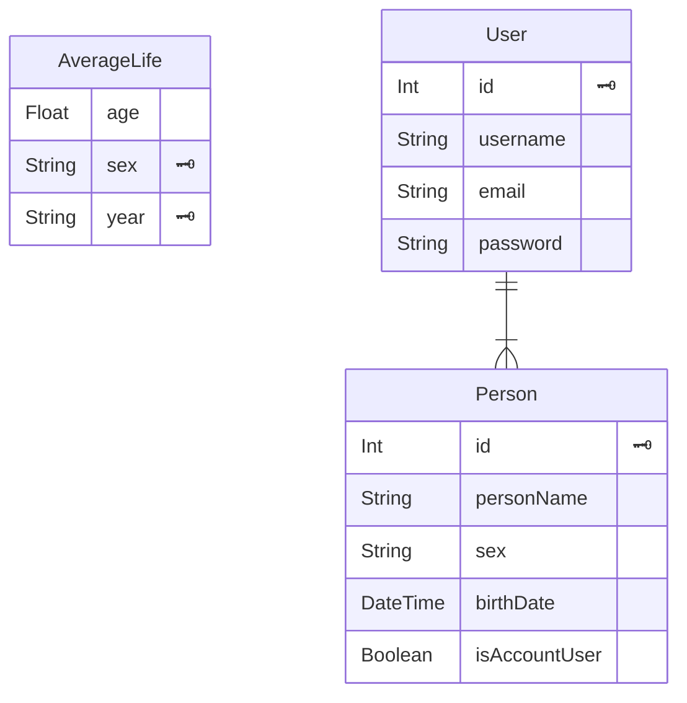

# RemainChecker
## **概要**
 - 余命を表示するアプリです。
 - アプリ利用者と登録した人物の余命をカウントダウン形式で確認できます。
 - アプリ利用者の余命は、ログイン/非ログインに関わらず表示できます。
## **目的**
 - アプリ利用者が自分に残された時間が少ないことを意識し、行動が促されること。
 - 自分が納得のできる、意味のある日々を過ごすこと。
  
 - 以下の要素によって、残りの人生で使用できる時間を強く意識することを期待しています。
     - 「**余命**」の文言
     - 余命の数値による可視化
     - 大切な人と過ごせる時間の表示
## **ターゲット** <br />
 - 行動力を向上させたい人
 - 意味のある日々を過ごしたい人

# サイトURL
https://remain-check-yutootake0015.vercel.app/　<br >

トップページでログインボタンを押下して遷移したログイン画面で以下の値を入力してください。
- メールアドレス
  - **`test@sample.com`**
- パスワード
  - **`1234567a`**

# 使用技術
| カテゴリ     | 技術             | バージョン        |
|------------|-----------------|----------------|
| **フロントエンド** | HTML           | -              |
|              | CSS            | -              |
|              | JavaScript     | -              |
|              | Material UI (MUI) | 5.14.16       |
|              | TypeScript     | 5.2.2          |
|              | React          | 18.2.0         |
|              | Next.js        | 14.0.0         |
| **バックエンド**  | JavaScript     | -              |
|              | Node.js        | 20.8.0         |
|              | Express        | 4.18.2         |
|              | Prisma         | 5.5.2          |
| **データベース**  | PostgreSQL     | 15.1 (Supabase) |
| **実行環境**      | Vercel         | - (フロントエンド) |
|              | Render         | - (バックエンド) |

## データベーススキーマ



# 環境構築　〜　ローカル実行方法
## 前提条件
 - データベースは事前に作成してください。
 - Node.jsは事前にインストールしてください。


## 実施手順
1. ローカルにソースコードをダウンロードする。
```
git clone https://github.com/YutoOtake0015/RemainCheck.git
```
2. frontendディレクトリとbackendディレクトリにcdコマンドで移動。
3. 2の各ディレクトリでライブラリをインストールする。
```
npm install
```
4. frontendディレクトリに直下に`.env.local`ファイルを作成し、以下環境変数を記述する。
```
NEXT_PUBLIC_API_BASEURL="http://localhost:(使用していないPORT)/api"
```
**注**："(使用していないPORT)" の部分は、実際に使用していないポート番号に置き換えてください。

5. backendディレクトリ直下に`.env`ファイルを作成し、以下環境変数を記述する。
```
DATABASE_URL="(データベースへの接続文字列)"
JWT_SECRET_KEY="(任意の文字列)"
CLIENT_ORIGIN="(クライアントのベースURL)"
```
 **注**："(データベースへの接続文字列)",  "(任意の文字列)", "(クライアントのベースURL)"は、任意の値に置き換えてください。

6. backendディレクトリで以下のコマンドを実行してテーブルを作成する。
```
npx prisma migrate --dev init
```
7. 2の各ディレクトリで以下のコマンドを実行してアプリを起動する。
```
npm run dev
```
8. frontendディレクトリで7を実行すると表示される、`http://localhost:xxxxxxx` にアクセスする。


# サイト機能一覧
本アプリで実装した機能は以下の通りです。
- サインアップ
- ログイン
- サインアウト
- ユーザ情報編集
  - ユーザのメールアドレス、パスワードを変更する機能。
- 余命表示
  - ユーザの余命を表示する機能。
- 余命一覧表示
  - 登録された人物情報を表形式で表示する機能
- 余命登録
  - ユーザ以外の人物情報を新規登録する機能
- 余命編集
  - 登録された人物情報を編集する機能


以上の中でさらに説明が必要な機能、処理を以下に追記します。
## ユーザ認証
ユーザの識別は、ログイン時にバックエンドで発行されるJWT(JSON Web Token)によって識別しています。 <br />
tokenは各ユーザが使用するブラウザのCookieに保管します。

## 余命算出
余命は、前年度の平均寿命から人物の年齢を減算することで算出しています。 <br />
平均寿命は、厚生労働省が発表した前年度の平均寿命を用いており、性別、年度ごとにAverageLifeテーブルで管理しています。 <br />
値はすべて秒に変換し、表示する単位(年ヶ月日時分秒)に応じて変換処理を実行しています。 <br />

余命がマイナスの人物は、「**無限の可能性が広がっています**」と表示されます。

### 計算式
 - 年齢(秒) = 現在日時(秒) - 生年月日(秒)
 - 余命(秒) = 前年度平均寿命(秒) - 年齢(秒)

## 余命一覧表示
登録した人物の情報は、表形式で一覧表示しています。 <br />
余命をソートすることで、残りの時間が短い人の特定、寿命の比較が容易にできます。<br />

例えば、余命が短い人物が判明した場合、その人と会う回数を多くすることで


# 今後の実装予定
今後、以下を実装予定です。
- パスワード再設定機能
- 他サービスアカウントでの認証機能
- 余命通知機能
  - 指定のタイミングで余命をメールアドレス宛に送信する機能。
  - アプリ未使用時であっても余命を意識できることで、本アプリの効果を受けることができます。
- 目標設定機能
  - 自分、他者に残された時間を参考に目標を立てる機能。
  - 残された時間を計画的に過ごすことで、やらなかった後悔を減らすことができます。
- スマートフォンアプリでの使用
  - 持ち歩くことの多いスマートフォンでアプリを使用できることにより、余命の確認をより手軽に行えます。
